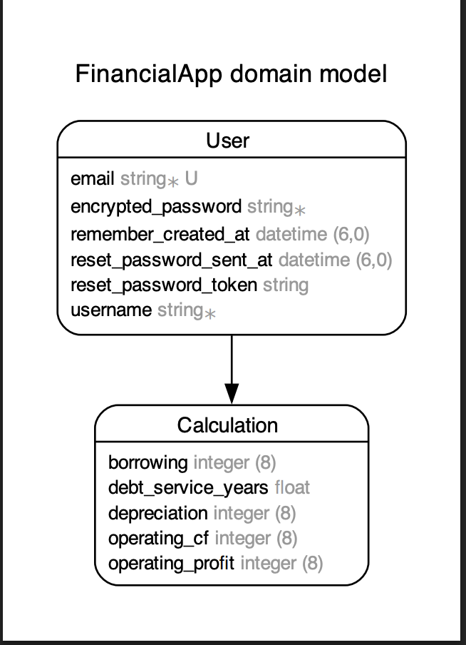

# サービス概要

利益と減価償却費、借入（予定）額を入力するだけで、自分の返済能力がわかるシンプルなアプリです。

---

## デモ画面

---

## サービスURL

[https://fin-app-kota-f0138686ce69.herokuapp.com/](https://fin-app-kota-f0138686ce69.herokuapp.com/)

---

## 開発の背景・目的

このサービスは、経験の浅い個人事業主や中小企業の代表、経理担当者を主なターゲットにしています。

銀行で融資相談を受ける中で、「融資の返済計画がイメージできない」ことや、銀行員に言われるがまま借りている人が多いという課題を感じました。

そこで、キャッシュフロー（CF）計算を簡単に行い、借入金の返済年数（債務償還年数）を明示することで、経営者が日頃から資金計画を意識しやすくし、

銀行審査での有利な条件獲得や無駄な借入れを防ぐ支援を目指しています。

---

## 機能

- 経常利益と減価償却費を入力して債務償還年数を算出  
- 算出した結果の保存（マイページにて削除可能）  
- ゲストログイン  

---

## 主な使用技術

### フロントエンド
- HTML / CSS / JavaScript  

### バックエンド
- Ruby 3.2.2  
- Ruby on Rails 7.1.3  
- MySQL（データベース）  

### インフラ・開発環境
- Heroku（デプロイ）  
- Git / GitHub（バージョン管理）  

---

## ER図

今後は運転資金の簡単な計算も行えるように考えており、その計算に必要なカラムを追加予定です。

---

## 今後の展望

- マイページに表示される計算結果履歴の編集機能の実装  
- 必要運転資金の計算機能の追加  
- 馴染みのない金融用語の解説ページの作成  

---

